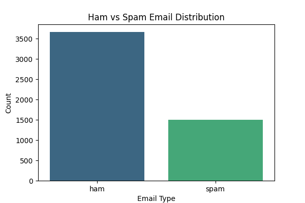
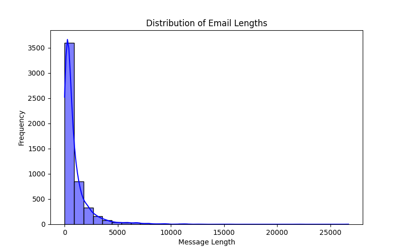
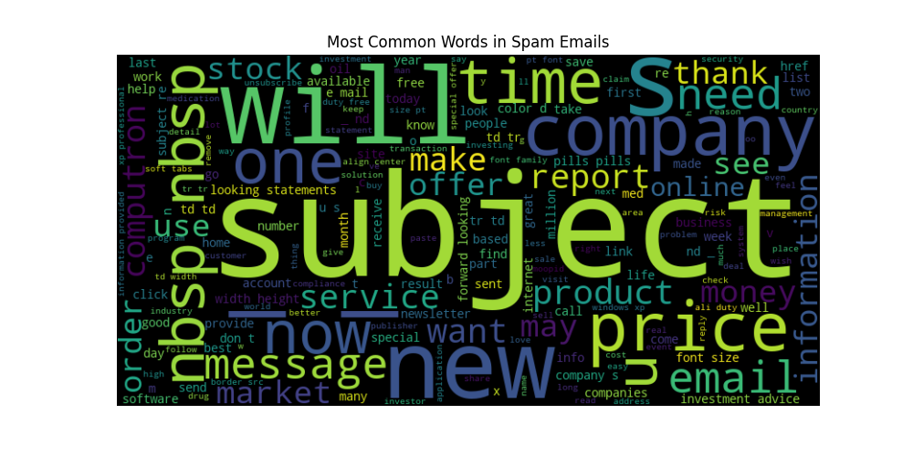
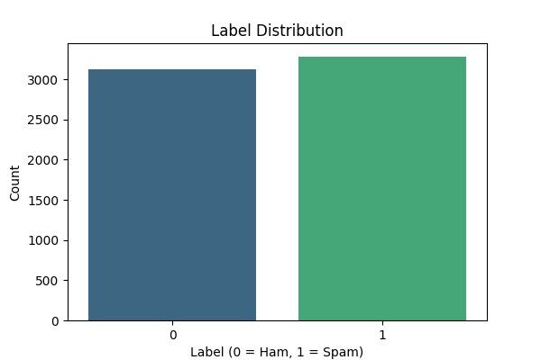
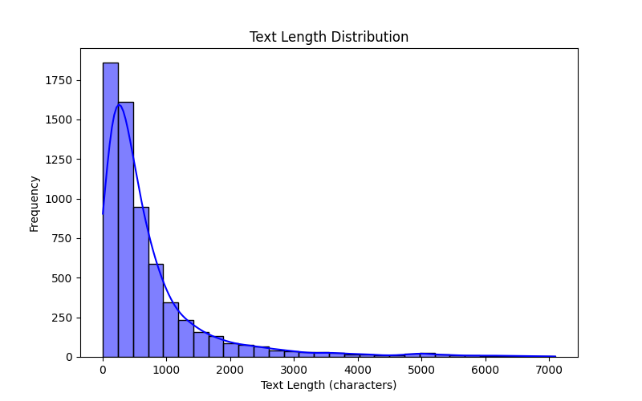
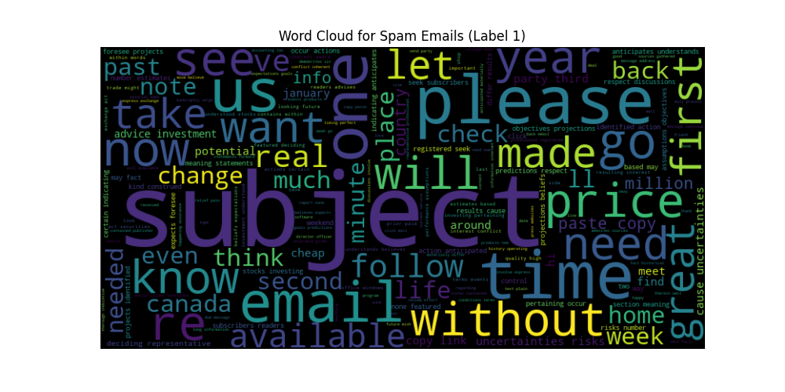

# 📧 Spam Email Classifier

## 📌 Overview
This project classifies emails as **Spam** or **Ham (Not Spam)** using Machine Learning techniques. The pipeline involves:

1. **Dataset Summary** – Understanding the dataset structure  
2. **Data Visualization** – Exploring patterns in spam and ham emails  
3. **Data Preprocessing** – Cleaning and preparing text data  
4. **Data Balancing** – Handling class imbalance using **SMOTE**  
5. **Final Dataset Preparation** – Generating refined data for model training  
6. **Model Training & Evaluation** – Training a classifier to detect spam emails  

---

## 📝 Step 1 - Dataset Summary

### 🔹 Overview
This script provides a quick summary of the dataset, including:
- First 5 rows of the dataset
- Shape (number of rows & columns)
- Missing values in each column
- Data types of each column

### 📂 File Reference
- **Script:** `data_summary.py`
- **Dataset Path:** `dataset/data.csv`

### 🚀 Running the Script
```bash
python data_summary.py
```

---
## 📊 Step 2 - Data Visualization

### 🔹 Overview
This script generates visual insights, including:
- **Class Distribution** – Spam vs. Ham emails (Bar Chart)
- **Message Length Distribution** – Email length variations (Histogram)
- **Spam Word Cloud** – Most frequent words in spam emails

### 📂 File Reference
- **Script:** `data_visualization.py`
- **Input Dataset:** `processed_data.csv`
- **Generated Visuals:** Stored in `visualizations/` folder

### 🖼️ Sample Visuals




### 🚀 Running the Script
```bash
python data_visualization.py
```

---
## 🧹 Step 3 - Data Preprocessing

### 🔹 Overview
This script cleans the dataset by:
1. **Removing Unnecessary Columns** (e.g., `Unnamed: 0`)
2. **Cleaning Text Data** – Converting text to lowercase, removing URLs, numbers, and punctuation
3. **Saving the Cleaned Dataset** as `processed_data.csv`

### 📂 File Reference
- **Script:** `data_preprocessing.py`
- **Input Dataset:** `data.csv`
- **Output Dataset:** `processed_data.csv`

### 🚀 Running the Script
```bash
python data_preprocessing.py
```

---
## ⚖️ Step 4 - Data Balancing (SMOTE)

### 🔹 Overview
Handles class imbalance using **SMOTE (Synthetic Minority Over-sampling Technique)**:
1. **Convert text into numerical features** using **TF-IDF**
2. **Apply SMOTE** to balance spam (1) and ham (0) emails
3. **Save the balanced dataset** as `smote_balanced_data.csv`

### 📂 File Reference
- **Script:** `balancing_data.py`
- **Input Dataset:** `processed_data.csv`
- **Output Dataset:** `smote_balanced_data.csv`

### 🚀 Running the Script
```bash
python balancing_data.py
```

---
## 📊 Step 5 - Final Data Preparation & Analysis

### 🔹 Overview
Refines the **balanced dataset**, cleans the text further, and performs **Exploratory Data Analysis (EDA)** using visualizations:
1. **Load the SMOTE-balanced dataset**
2. **Cleaning the text** using regular expressions (regex).
3. **Removing duplicate entries.** 
4. **Performing dataset summary checks** (e.g., verifying missing values, data shape, and label distribution).
5. **Generating and saving visualizations** to gain key insights into the data.

### 📂 File Reference
- **Script:** `final_dataset.py`
- **Input Dataset:** `smote_balanced_data.csv`
- **Output Dataset:** `final_dataset.csv`
- **Visualization Folder:** `final_data_visualizations/`

### 🖼️ Key Visual Insights




### 🚀 Running the Script
```bash
python final_dataset.py
```

---
## Next Steps - Model Training & Evaluation

### 🔹 Overview
This script trains a **Machine Learning model** to classify emails:
1. **Splits the dataset** into training and testing sets
2. **Trains a classifier** (e.g., Logistic Regression, Naive Bayes, or Random Forest)
3. **Evaluates the model** using accuracy, precision, recall, and F1-score
4. **Saves the trained model** for future testing

### 📂 File Reference
- **Script:** `train_model.py`
- **Input Dataset:** `final_dataset.csv`
- **Saved Model:** `spam_classifier.pkl`

### 🚀 Running the Script
```bash
python train_model.py
```

---
## 🔄 Workflow Overview
📌 The entire workflow follows this structure:
```plaintext
Raw Dataset → Preprocessing → SMOTE Balancing → Model Training → GUI → Next js webapp
```

---
## 📩 Contact
For any queries, feel free to reach out:
📧 **Email:** chaudharyhadi27@gmail.com


## 📦 Setup Instructions

## 🔧 Clone Dataset Only (Optional)
### I recommend cloning the entire project along with all files for full functionality.
**But if you only want the dataset, here are the steps to do that:**
```bash
git clone --filter=blob:none --no-checkout https://github.com/chaudhary-hadi27/Model_v1.git
cd Model_v1

git sparse-checkout init --cone
git sparse-checkout set dataset

cd dataset

# Setup 
conda env create -f ../environment.yml 
conda activate spam_classification

```


## 🔗 To clone the full project `(dataset + backend + frontend + models)`, check out the [README.md](../README.md).