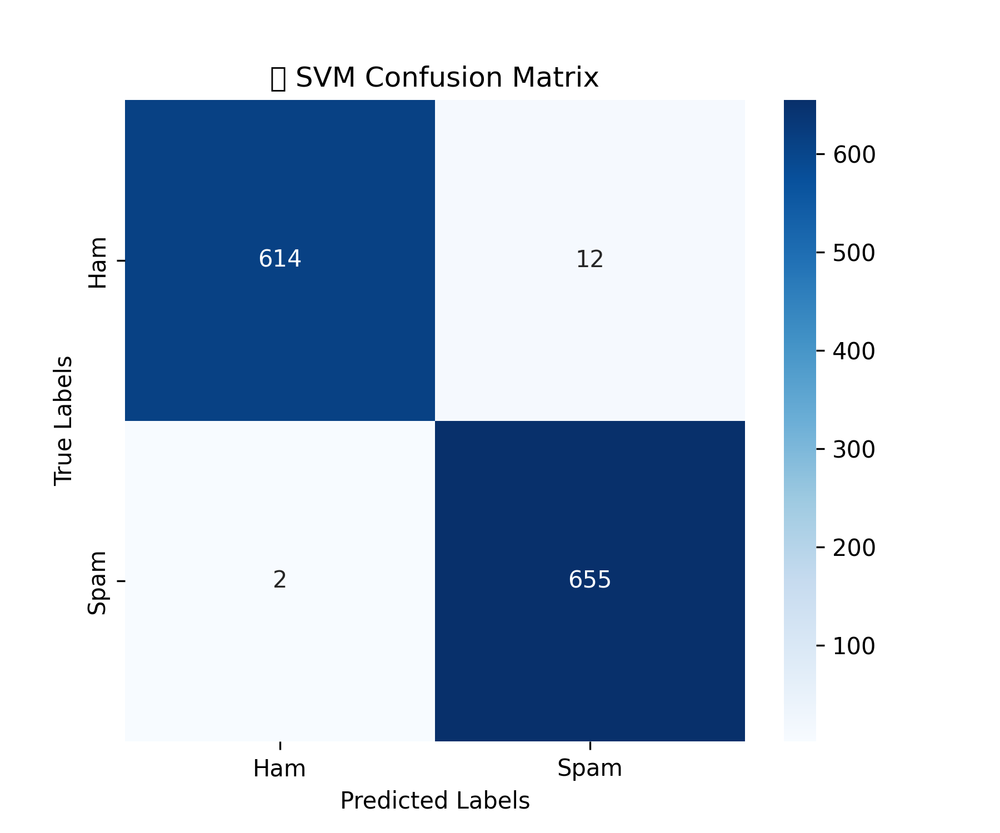

# 📁 `models-&-reports/` – Trained Model & Evaluation Results

This directory contains the final saved **SVM model**, vectorizer, evaluation reports, and visualization for the **Spam Email Classification** system.

---

## 🧠 How the Model Was Built

The dataset was cleaned and preprocessed, then vectorized using **TF-IDF (with unigrams and bigrams)**. To handle class imbalance, **SMOTE** was applied before training. Multiple models were evaluated, but **SVM** was selected based on its superior real-world performance and minimal false positives.

---

## 📌 Contents

| File Name                        | Description                                               |
|----------------------------------|-----------------------------------------------------------|
| `spam_svm.pkl`                   | Final trained Support Vector Machine model               |
| `tfidf_vectorizer.pkl`          | TF-IDF vectorizer fitted on training data                |
| `svm_classification_report.txt` | Classification metrics for SVM                           |
| `svm_confusion_matrix.png`      | Confusion matrix (SVM)                                   |

---

## 🔍 Model Specifications

### ✅ SVM (Support Vector Machine)
- Kernel: `linear`
- Regularization (C): `1.0`
- Probability Output: `True`
- Accuracy: ~`99%`

> ⚠️ **Real-World Note:**  
> ⚠️ Although both SVM and XGBoost models were trained, SVM shows more reliable performance in real-world testing with better generalization and fewer misclassifications on unseen emails.
---

## ⚙️ Preprocessing & Feature Engineering

- **Text Vectorization**:  
  `TfidfVectorizer(max_features=10,000, stop_words='english', ngram_range=(1,2))`
  
- **Balancing Technique**:  
  `SMOTE` applied to training data for handling class imbalance
  
- **Data Split**:  
  `train_test_split` (80/20) with `stratify=y` for balanced label distribution

---

## 📈 Evaluation

The model was evaluated using:
- **Accuracy**, **Precision**, **Recall**, **F1-score** metrics
- **Confusion matrix visualizations** saved as `.png` images
- **Classification report** saved as `.txt`

### ✅ Saved Evaluation Results

1. **SVM Classification Report**
   - The classification report is saved in the `svm_reports/svm_evaluation_report.txt` file.
   - It contains detailed metrics like precision, recall, F1-score, and support for each class.

      ```plaintext
      📊 SVM Accuracy: 99.39%
      🔍 SVM Classification Report:
                    precision    recall  f1-score   support

                0       1.00      0.99      0.99       735
                1       0.99      1.00      0.99       734

          accuracy                           0.99      1469
          macro avg       0.99      0.99      0.99      1469
       weighted avg       0.99      0.99      0.99      1469
     

    - The confusion matrix is saved in the `svm_reports/svm_confusion_matrix.png` file.
    - 
   
---


## 📦 Setup Instructions

## 🔧 Clone Model-&-Reports Only (Optional)
### I recommend cloning the entire project along with all files for full functionality.
**But if you only want the model-&-reports, here are the steps to do that:**

```bash
git clone --filter=blob:none --no-checkout https://github.com/chaudhary-hadi27/Model_v1.git
cd Model_v1

git sparse-checkout init --cone
git sparse-checkout set model-&-reports

cd models-&-reports

# Setup 
pip install joblib
```


## 🔗 To clone the full project `(dataset + backend + frontend + models)`, check out the [README.md](../README.md).

---
# 🚀 Usage Example

```python
import joblib

# ✅ Load the trained SVM model and TF-IDF vectorizer
svm_model = joblib.load("spam_svm.pkl")
vectorizer = joblib.load("tfidf_vectorizer.pkl")

# ✅ Sample emails to test
emails = [
    "Win a free iPhone! Click here to claim your prize now!",
    "Hey John, just checking if you're available for the meeting tomorrow."
]

# ✅ Transform the emails using the vectorizer
X_test = vectorizer.transform(emails)

# ✅ Predict using the SVM model
predictions = svm_model.predict(X_test)

# ✅ Print the results
for i, email in enumerate(emails):
    label = "Spam" if predictions[i] == 1 else "Ham"
    print(f"📧 Email: {email}")
    print(f"🔍 Prediction: {label}")
    print("-" * 40)
```

## Output :
```
📧 Email: Win a free iPhone! Click here to claim your prize now!
🔍 Prediction: Spam
----------------------------------------
📧 Email: Hey John, just checking if you're available for the meeting tomorrow.
🔍 Prediction: Ham
----------------------------------------
```