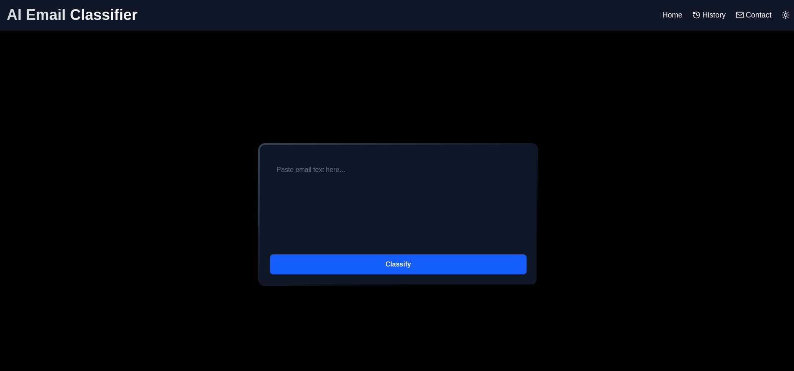
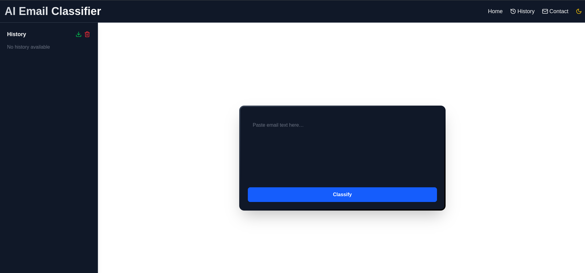
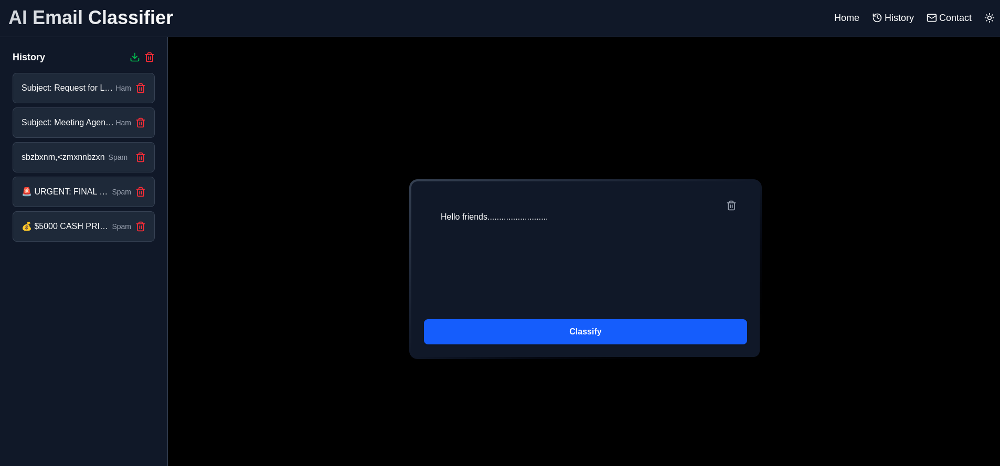

# AI Spam Classifier (Next.js + TypeScript)

This is the **frontend** of an AI Email Classifier web app, built using **Next.js**, **TypeScript**, **Framer Motion**, and **Lucide Icons**. It provides a user-friendly interface to classify input text as "Spam" or "Ham", view and manage history, export it as CSV, and toggle between dark and light themes.

## 🚀 Features

- Classify email-like text as **Spam** or **Ham**
- Maintain **prompt history** with delete and clear functionality
- Export **history as CSV**
- Responsive **dark/light mode toggle**
- Animated UI using **Framer Motion**
- **Contact options** to email the developer
- Basic client-side validation and error handling

## 📁 File Structure

### `src/app/page.tsx`
Main component that handles:
- State management (`useState`, `useEffect`)
- Classification logic with a fake random generator (placeholder for actual ML model)
- API interactions to save, fetch, and delete prompts
- UI layout and components integration
- Dark mode toggle and contact menu

**References Components:**
- [HistoryPanel.tsx](src/components/HistoryPanel.tsx)
- [TextAreaPanel.tsx](src/components/TextAreaPanel.tsx)

---

### `src/components/HistoryPanel.tsx`
Displays history of classified prompts:
- Shows list of past entries
- Allows deleting individual prompts
- Provides buttons to:
  - Export history as `.csv`
  - Clear all history

Uses:
- `Framer Motion` for slide-in animation
- `Lucide Icons` for Trash and Download icons

---

### `src/components/TextAreaPanel.tsx`
(You didn’t fully paste this one, but assuming typical behavior)

Handles:
- Text input area
- Submit button to classify
- Displays result
- Loading state and error messages

---

## 🛠️ Technologies Used

- [Next.js](https://nextjs.org/)
- [React](https://react.dev/)
- [TypeScript](https://www.typescriptlang.org/)
- [Framer Motion](https://www.framer.com/motion/)
- [Lucide React Icons](https://lucide.dev/)
- [PapaParse](https://www.papaparse.com/) (for CSV export)

---

## 📡 API Endpoints

- `POST /predict` - Predicts whether the input is Spam or Ham using the trained SVM model.
- `POST /api/savePrompt` – Saves a prompt and its classification (Spam/Ham) into the SQLite database.
- `GET /api/getPrompts` – Returns the list of saved prompts from the database.
- `DELETE /api/deletePrompt/:id` – Deletes a specific prompt using its ID.
- `DELETE /api/clearPrompts` – Deletes all prompts (clears history).

> You need a backend server running on `localhost:8000` that handles these routes.

---

## 📬 Contact

This app allows users to send an email to the developer via:
- Web Gmail
- Outlook Web
- Default Mail App

Default contact:
- **Email:** chaudharyhadi27@gmail.com

---

## 📦 Setup Instructions

## 🔧 Clone Frontend Only (Optional)

### I recommend cloning the entire project along with all files for full functionality.

**But if you only want the frontend, here are the steps to do that:**
- The frontend does not classify any email if the backend is not running, because it relies on the backend functionalities .
- Ensure all paths are correct.

```bash
git clone --filter=blob:none --no-checkout https://github.com/chaudhary-hadi27/Model_v1.git
cd Model_v1
git sparse-checkout init --cone
git sparse-checkout set frontend-Next.js

cd frontend-Next.js

npm install
npm run dev
```

## 🔗 To clone the full project `(dataset + backend + frontend + models)`, check out the [README.md](../README.md).

---

## 📸 Screenshots



